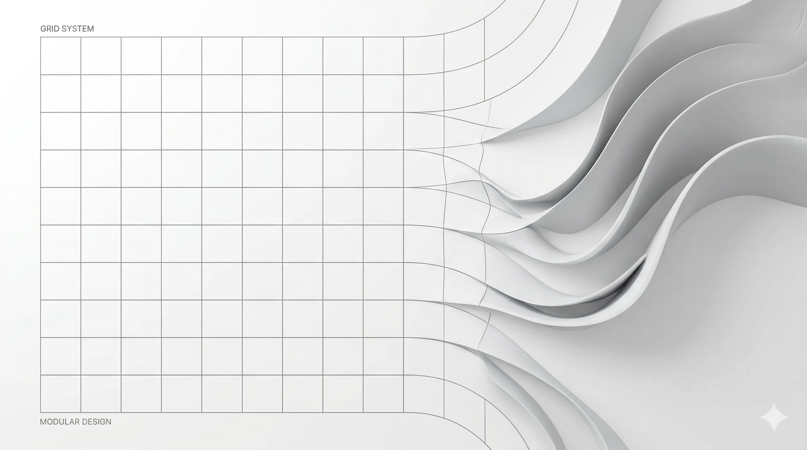
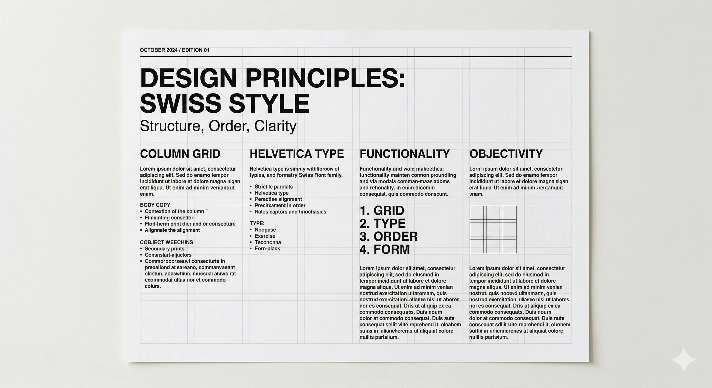
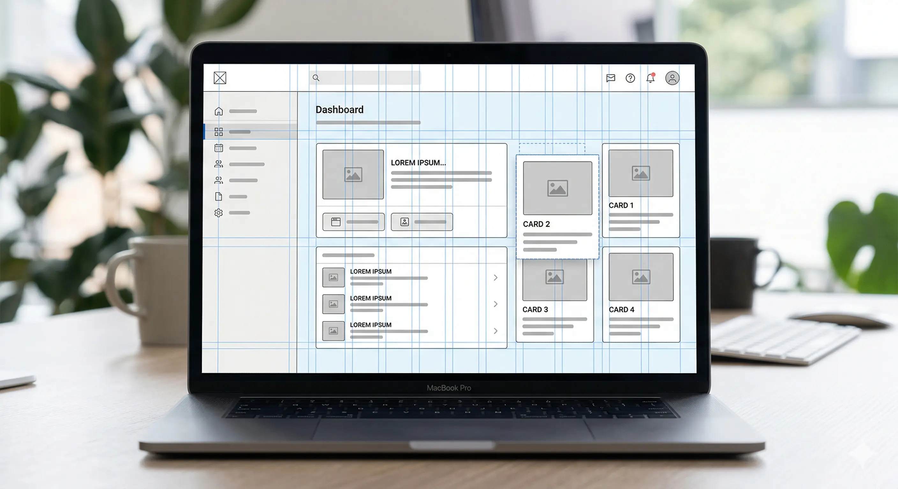
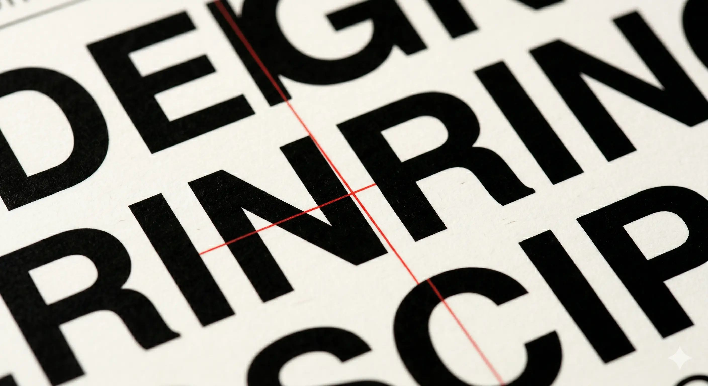
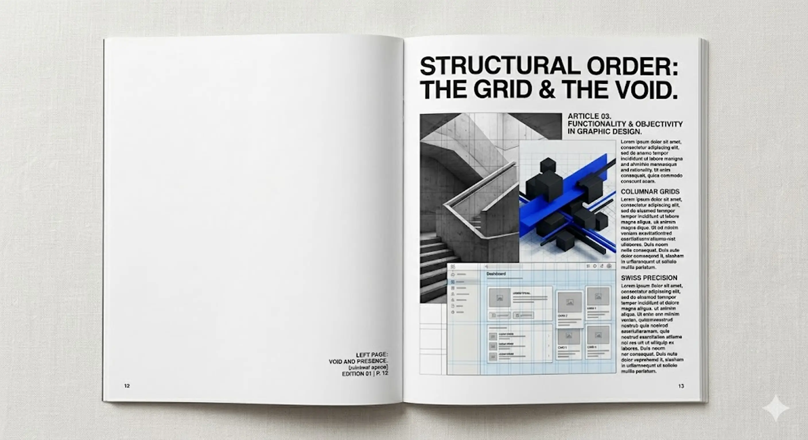
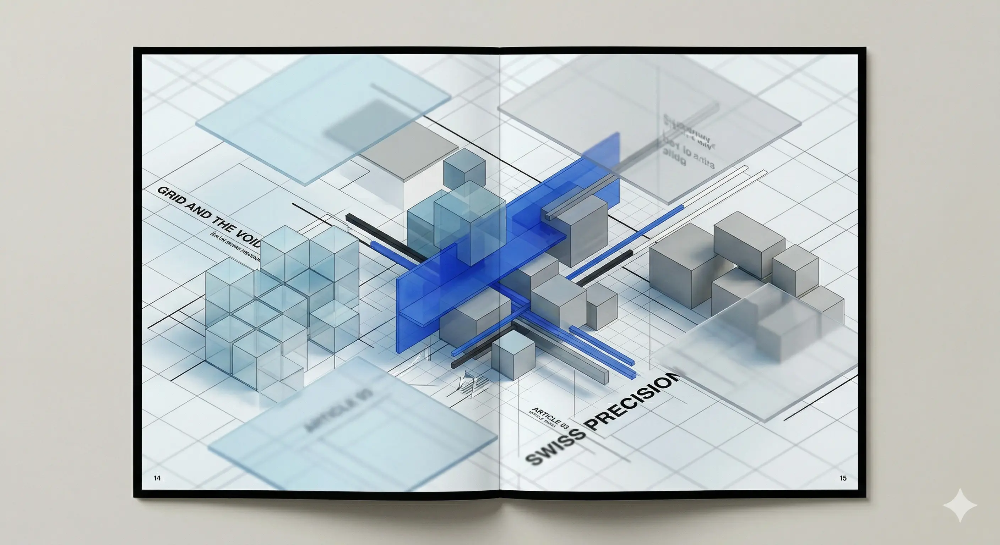

(./photo1.webp)

Design is often misunderstood as pure, unbridled creativity. In reality, the most compelling work is rooted in structure. Before a single pixel is placed, there is an underlying framework—a grid—that ensures consistency, readability, and balance. But there comes a point in every designer's journey where following the rules becomes too safe. 

To create work that truly resonates, you must understand the structure well enough to challenge it. Much like legal precedents, design rules exist to be understood before they're strategically challenged. When done correctly, breaking the grid doesn't create chaos; it creates energy.

## The Foundation: Why Grids Exist

To understand deviation, we must first respect the standard. Grids are the invisible scaffolding of design. They align elements, establish hierarchy, and guide the viewer's eye through a composition without them realizing it. In corporate branding or data-heavy interfaces, the grid is non-negotiable. It builds trust through order.

However, strict adherence can sometimes lead to work that feels sterile or generic. When every element locks perfectly into place, the design may feel predictable. This is where the opportunity lies.

## The Art of Deviation

Breaking the grid is not about carelessness; it is about intentional disruption. It involves shifting elements slightly off-axis, overlapping containers, or allowing typography to bleed into whitespace. The goal is to create tension that captures attention without sacrificing usability.

One effective technique is asymmetric balance. Instead of centering a heading, push it to the extreme edge. Instead of keeping images within their boxes, let them overlap the text slightly. This layering creates depth and suggests movement on a static page.

## Visual Impact: Case Studies

Consider editorial design. Magazines often use strict grids for body copy to ensure readability, but they break the grid for headlines and pull quotes. This contrast tells the reader what is important. In digital design, breaking the grid can highlight a Call-to-Action (CTA) button or a key brand message.

When elements defy the expected structure, the human brain pauses to process the anomaly. That pause is engagement. By layering images over text or allowing shapes to intersect boundaries, you create a visual narrative that feels dynamic rather than static.

## When to Break vs. When to Stick

The critical skill is knowing *when* to break the rules. 

*   **Stick to the Grid:** Financial reports, legal interfaces, healthcare dashboards, and long-form reading content. Here, clarity and trust are paramount.
*   **Break the Grid:** Brand campaign landing pages, artistic portfolios, music festival posters, and product launches. Here, emotion and memorability are the goals.

## Conclusion

Structure provides the stage, but breaking it creates the performance. A design portfolio that showcases both strict adherence and strategic deviation demonstrates versatility. It tells potential clients that you can be trusted with their corporate identity, but you also have the creative vision to make them stand out in a crowded market.

If you're looking for a design partner who knows when to follow the rules and when to rewrite them, let's collaborate.
