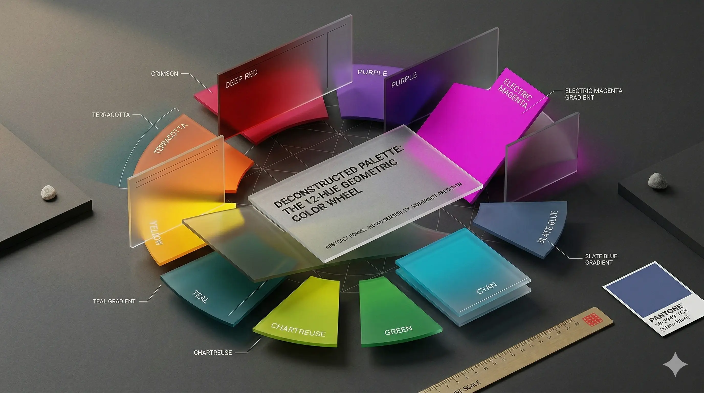
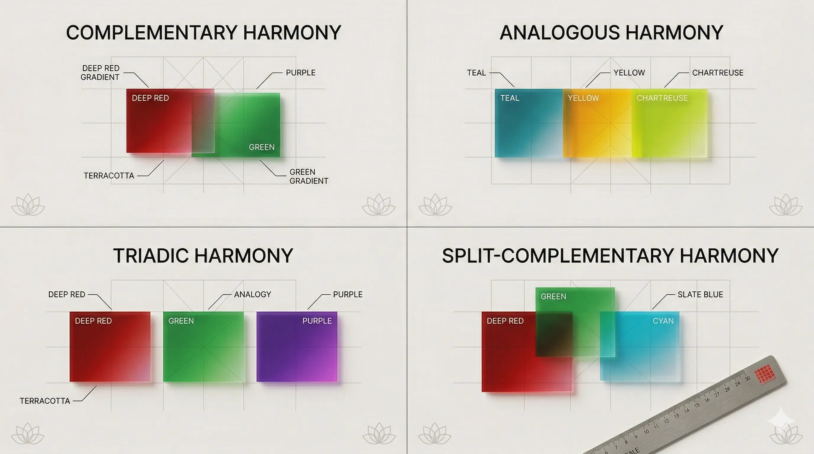
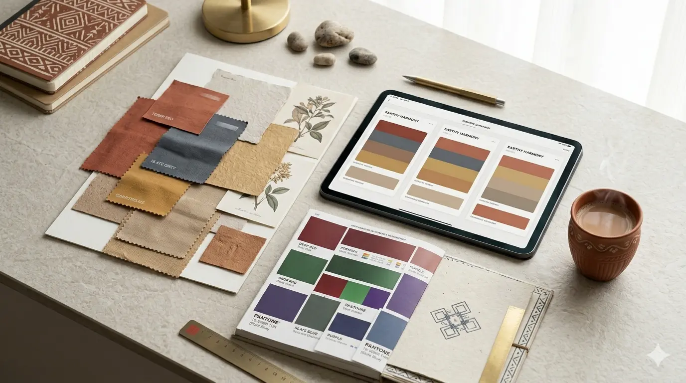
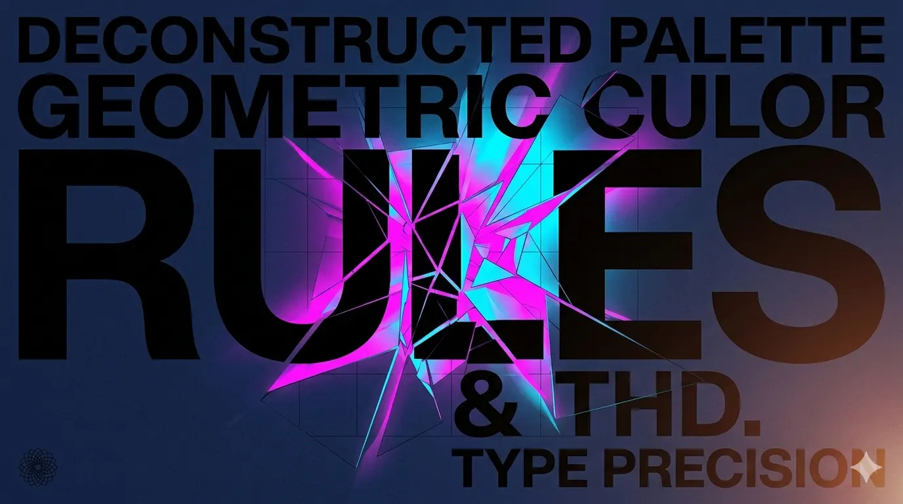
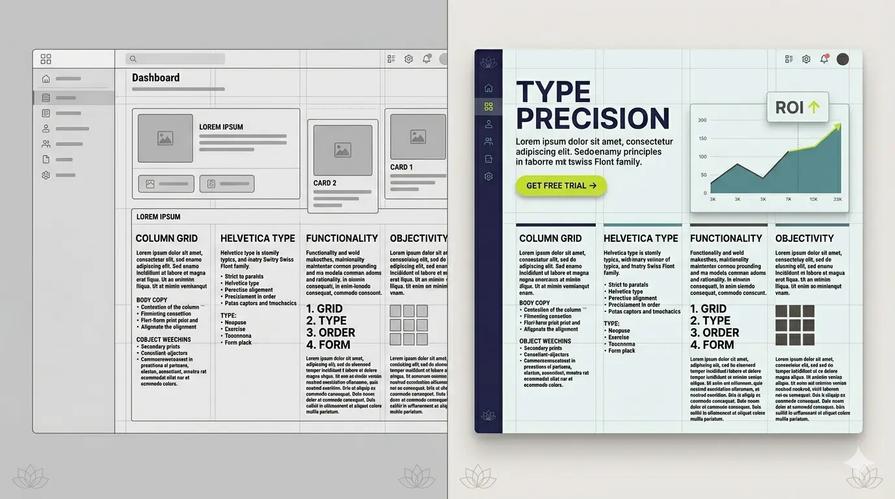
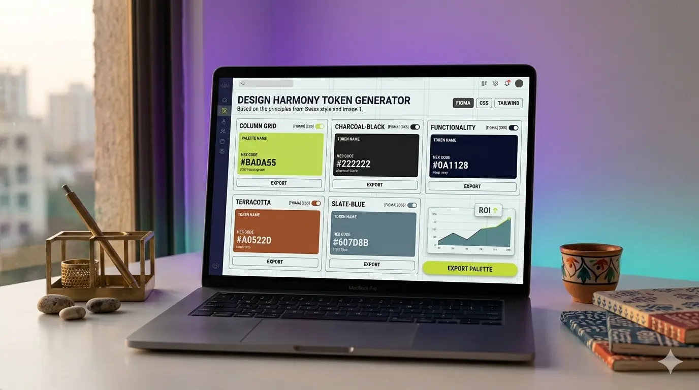

Colour is rarely just decorative. In professional design, it is a psychological trigger, a hierarchy builder, and a silent communicator. When executed well, it does not just catch the eye—it guides behaviour, establishes trust, and elevates perceived value.

As a creative who bridges structured frameworks with visual storytelling, I have learned that both disciplines share a core truth: **structure exists to be mastered, not blindly followed.** Colour theory is no different. It is a blueprint, not a cage.

In this guide, we shall break down the foundational colour wheel, explore harmonies that actually work in client projects, walk through systematic palette construction, and—most importantly—learn when and how to strategically break conventions to create work that stands out in a saturated market.

## Decoding the Colour Wheel for Modern Design

The traditional 12-hue colour wheel remains the backbone of visual design, but modern workflows rarely stop there. Understanding the relationships between primary, secondary, and tertiary hues gives you the vocabulary to speak fluently with clients who often only know what they *feel* about a colour, not why it works.

- **Primary Hues (Red, Blue, Yellow):** The irreducible building blocks. High purity, high impact. Ideal for brands that need instant recognition.
- **Secondary Hues (Orange, Green, Violet):** Created by mixing two primaries. They carry balanced energy and are excellent for bridging contrasting elements in a layout.
- **Tertiary Hues (Red-Orange, Blue-Green, etc.):** The subtle shifts that add sophistication. Tertiary colours are where "premium", "muted", and "editorial" aesthetics live.

**Pro Tip for Client Work:** Always present your colour choices alongside their hex, RGB, CMYK, and Pantone equivalents early in the process. Ambiguity breeds revision cycles. Precision builds confidence—and speeds up approvals.

## Colour Harmonies That Actually Work in Practice

Harmonies are predictable relationships that the human eye naturally finds pleasing. They are your first line of defence against visual chaos. But theory only matters when it translates to real-world application.

### 1. Complementary
Opposite colours on the wheel (e.g., Blue & Orange). High contrast, maximum vibrancy. Best for CTAs, focal points, or energetic brand personalities. Use sparingly—too much creates visual fatigue and can feel aggressive on mobile screens.

### 2. Analogous
Three adjacent colours (e.g., Teal, Blue, Indigo). Naturally cohesive, calming, and ideal for editorial layouts, wellness brands, or tech interfaces. Add a neutral (black, white, warm grey) to ground it and improve readability.

### 3. Triadic
Three colours evenly spaced (e.g., Red, Yellow, Blue). Balanced but lively. Requires a dominant colour (60%), a secondary (30%), and an accent (10%) to avoid looking like a cartoon. Perfect for lifestyle brands that need energy without chaos.

### 4. Split-Complementary & Tetradic
More complex, higher nuance. Split-complementary reduces tension while keeping contrast—great for SaaS dashboards. Tetradic (two complementary pairs) is rich but demands strict hierarchy to prevent muddiness. Reserve for experienced hands.

**Workflow Hack:** I always test harmonies in greyscale first. If the contrast and layout do not hold up without colour, the foundation is weak. Add colour to enhance, not rescue.

## Building Professional Palettes: Step-by-Step

A great palette is not pulled from a trendy Pinterest board. It is engineered around context: audience, medium, accessibility, and brand voice. Here is how I approach it for client work:

### Step 1: Assign Functional Roles
Give every colour a job:
- **Primary:** Brand recognition, headers, key UI elements
- **Secondary:** Supporting visuals, subheaders, illustrations
- **Accent:** CTAs, hover states, interactive feedback
- **Neutrals:** Backgrounds, body text, spacing elements

### Step 2: Respect the 60-30-10 Rule (But Adapt It)
- 60% dominant (usually a neutral or soft tone)
- 30% secondary
- 10% accent  
*Exception:* Digital products often shift to 70/20/10 for better readability and reduced cognitive load on smaller screens.

### Step 3: Test for Accessibility Early
WCAG 2.2 AA compliance is not optional. Run every text/background pairing through a contrast checker. If it fails, adjust saturation or lightness—not hue. A failed contrast ratio is not a design flaw; it is an exclusionary one.

### Step 4: Document Systematically
Create a style tile or token sheet before mocking up full layouts. Include usage guidelines, hex/RGB/CMYK values, and "do/don't" examples. Clients appreciate predictability. Designers thrive on it. Future-you will thank you.

## The Strategic Art of Breaking Colour Rules

Colour theory teaches harmony, but innovation thrives in controlled tension. Some of the most memorable brands intentionally introduce dissonance. Here is how to do it without breaking usability:

### 1. The "Wrong" Accent
Placing a low-saturation pastel against a neon accent creates deliberate friction. It works when you want to signal disruption, youth culture, or avant-garde positioning. Use it to highlight a single, high-value action.

### 2. Monochrome + One Outlier
A strictly greyscale layout interrupted by a single saturated hue draws the eye instantly. Used in editorial, luxury packaging, or SaaS dashboards to highlight critical data without visual noise.

### 3. Cultural Recontextualisation
Colours carry cultural weight. What reads as "professional" in one market may signal "warning" or "cheap" in another. Breaking regional expectations requires research, not rebellion. Always validate with local user testing.

**The Golden Rule of Breaking Rules:** You must understand *why* a convention exists before you violate it. Intentional dissonance elevates. Accidental chaos confuses.

In design, as in any disciplined craft, precedent exists to be understood before it is innovated upon. Once you know how the eye naturally travels, you can redirect it with purpose.

## Translating Theory into Client ROI

Clients do not buy colour palettes. They buy clarity, conversion, and competitive differentiation. Frame your colour decisions around measurable outcomes:

- **E-commerce:** High-contrast complementary accents on checkout buttons lift conversion rates by reducing decision friction. Test, measure, iterate.
- **B2B/Tech:** Analogous cool tones with a single warm accent communicate stability while highlighting action points. Trust + clarity = shorter sales cycles.
- **Lifestyle/Editorial:** Triadic or tetradic palettes create visual rhythm that encourages longer scroll depth and content engagement. Rhythm retains attention.

Always tie your colour rationale to business goals. When clients understand the *why*, approvals move faster. Revisions shrink. Trust compounds.

## Final Thoughts & Next Steps

Colour theory is not about memorising combinations. It is about building a decision-making framework that scales with every project, every client, and every medium you touch. Master the wheel. Internalise the harmonies. Systematise your palettes. Then, when the project demands it, break the rules with precision.

If you are looking to streamline your colour workflow, I have built a lightweight, developer-friendly tool that generates accessible palettes, exports design tokens, and integrates directly with Figma, CSS, and Tailwind.

[click here](https://swabdesigns.lovable.app/tools/swab-colours)to access swabColours Lab

What is your go-to harmony for brand work? Drop it in the comments or tag me on social—I would love to see how you are pushing colour forward this year. Let us learn from each other.